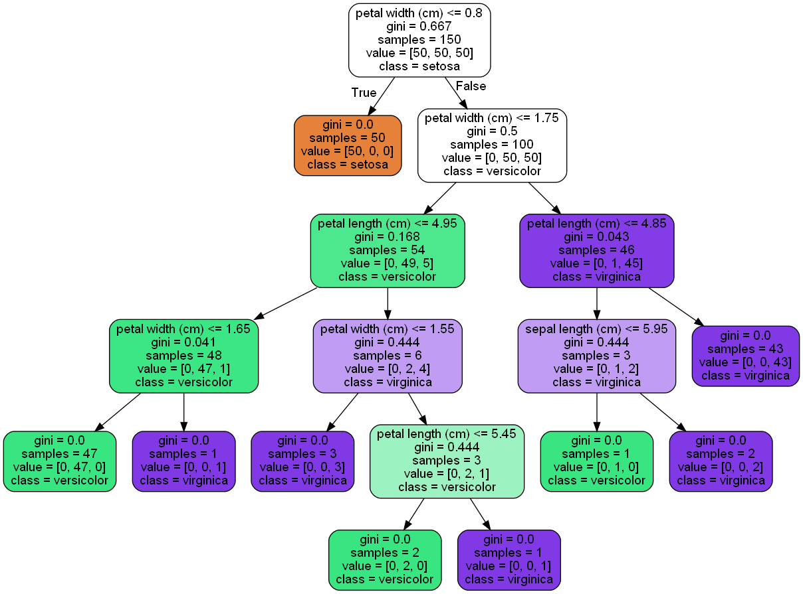

## 基本流程

一般的，一棵决策树包含一个根结点、若干个内部结点和若干个叶结点；叶结点对应于决策结果，其他每个结点则对应于一个属性测试，每个结点包含的样本集合根据属性测试的结果被划分到子结点中；根结点包含样本全集。从根结点到每个叶结点的路径对应了一个判定测试序列。决策树学习的目的是为了产生一棵泛化能力强的决策树。

------

**输入：**

训练集$D = {(x_1, y_1),(x_2, y_2),...,(x_m, y_m)}$；属性集$A = {a_1, a_2, ..., a_d}$

**过程：**函数$TreeGenerate(D, A)$

1. 生成结点node;
2. if D 中样本全属于同一类别C then
3. ​    将node标记为C类叶结点; return
4. end if
5. if A = $\emptyset$ or D中样本在A上取值相同 then
6. ​    将node标记为叶结点，其类别标记为D中样本数最多的类; return
7. end if
8. 从A中选择最优划分属性$a_*$;
9. for $a_*^v$ in $a_*$ do
10. ​    为node生成一个分支; 令$D_v$表示D中在$a_*$上取值为$a_*^v$的样本子集;
11. ​    if $D_v$为空 then
12. ​        将分支结点标记为叶结点，其类别标记为D中样本最多的类; return
13. ​    else
14. ​        以$TreeGenerate(D_v, A \setminus {a_*})$为分支结点
15. ​    end if
16. end for

**输出：**以node为根节点的一棵决策树

------

决策树的生成是一个递归过程。在决策树的基本算法中，有三种情形会导致递归返回：

- 当前结点包含的样本全属于同一类别，无需划分；
- 当前属性集为空，或所有样本在所有属性上取值相同，无法划分；
- 当前结点包含的样本集合为空，不能划分。

第二种情况下，我们把该叶结点的类别设定为该结点所含样本最多的类别；第三种情况下，将该结点类别设置为其父结点所含样本最多的类别。前者使用当前结点的后验分布，后者使用当前结点的父结点的先验分布。

## 划分选择

选择最优划分属性的这一步很关键，随着划分过程不断进行，我们希望决策树的分支结点所包含的样本尽可能属于同一类别。

### 信息增益

假设当前样本集合D中第k类样本所占的比例为$p_k (k = 1, 2, ..., \vert \gamma \vert)$，则D的信息熵定义为：

$$
Ent(D) = - \sum_{k=1}^{\vert \gamma \vert} p_k \log_2{p_k}
$$

$Ent(D)$的值越小，则D的纯度越高。

假定离散属性a有V个可能的取值$\{a^1, a^2, ..., a^V\}$，若使用a来对样本集D进行划分，则会产生V个分支结点，其中第v个分支结点包含了D中所有在属性a上取值为$a^v$的样本，记为$D^v$。于是$D^v$的信息熵可以计算出来，再考虑到不同的分支结点所包含的样本数不同，给分支结点赋予权重$\vert D^v \vert / \vert D \vert$，即样本数越多的分支结点的影响越大，于是使用属性a对样本集D进行划分所获得的信息增益为：

$$
Gain(D, a) = Ent(D) - \sum_{v=1}^V \frac {\vert D^v \vert} {\vert D \vert} Ent(D^v)
$$

信息增益越大，使用属性a进行划分所获得的结点纯度提升越大。因此选择最优化分属性时的准则为：

$$
a_* = \mathop{\arg \max}_{a \in A} \quad Gain(D, a)
$$

ID3决策树学习算法就使用信息增益准则来选择划分属性。

### 信息增益率

信息增益准则对可取值数目较多的属性有所偏好，属性取值越多，进行划分后每种取值下的分支结点纯度越高，但这会导致树的过拟合。C4.5决策树算法引入了信息增益率：

$$
Gain.ratio(D, a) = \frac {Gain(D, a)} {IV(a)}
$$

其中

$$
IV(a) = - \sum_{v=1}^{V} \frac {\vert D^v \vert} {\vert D \vert} \log_2{\frac {\vert D^v \vert} {\vert D \vert}}
$$

称为属性a的固有值（Intrinsic value）。属性a的可取值数目越多，则$IV(a)$越大。这样同时带来了一个问题，信息增益率准则会偏好取值数目较少的属性。因此C4.5采用了一个启发式算法：先从候选属性中找出**信息增益**高于平均水平的属性，再从中选择**增益率**最高的。

### 基尼系数

CART决策树使用基尼系数：

$$
\begin{aligned}
Gini(D) &= \sum_{k=1}^{\vert \gamma \vert} \sum_{k^{'} \neq k} p_k p_{k^{'}} \\
&= 1 - \sum_{k=1}^{\vert \gamma \vert} p_k^2
\end{aligned}
$$

基尼系数反映了从数据集D中随机抽取两个样本，其类别标记不一致的概率，因此越小结点纯度越高。同样的，属性a的基尼系数定义为：

$$
Gini.index(D, a) = \sum_{v=1}^V \frac {\vert D^v \vert} {\vert D \vert} Gini(D^v)
$$

因此选择最优化分属性时的准则为：

$$
a_* = \mathop{\arg \min}_{a \in A} \quad Gini.index(D, a)
$$

## 剪枝处理

剪枝是决策树应对过拟合的主要手段。

**预剪枝：**

*在决策树生成过程中，对每个结点在划分前先进行估计，若当前划分不能带来决策树泛化性能的提升，则标记为叶结点。*预剪枝降低了过拟合的风险，还显著减少了决策树的训练时间开销和测试时间开销。但另一方面，有些分支的当前划分虽不能提升泛化性能，甚至可能导致泛化性能暂时下降，但在其基础上进行的后续划分却有可能导致性能显著提高，预剪枝基于贪心原则禁止这些分支的展开，使得预剪枝决策树可能会欠拟合。  

**后剪枝：**

*先从训练集生成一棵完整的决策树，然后由底向上，判断若当前非叶结点标记为叶结点，能否带来决策树泛化性能的提升，若可以则将该结点替换为叶结点。*后剪枝决策树通常会比预剪枝决策树保留更多的分支，一般情况下后剪枝决策树的欠拟合风险小，泛化性能往往由于预剪枝决策树，但后剪枝过程需要先生成一棵完整的决策树，再自底向上对每一个非叶结点进行逐一考察，训练时间开销要大得多。

## 连续与缺失值


## 多变量决策树


## 示例

```python
import pydotplus
from sklearn.datasets import load_iris
from sklearn.tree import DecisionTreeClassifier, export_graphviz

iris = load_iris()
clf = DecisionTreeClassifier()
clf.fit(iris.data, iris.target)
dot_data = export_graphviz(
    clf,
    feature_names=iris.feature_names,
    class_names=iris.target_names,
    filled=True,
    rounded=True
)
pydotplus.graph_from_dot_data(dot_data).write_png('iris.png')
```



## 参考文献

[1] 周志华.机器学习[M].北京：清华大学出版社，2016：73-95

[2] [简单Python决策树可视化实例](https://blog.csdn.net/u012845311/article/details/77294973)
