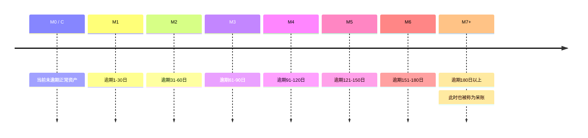

信贷风险管理是一项综合性工作，它贯穿于整个信贷业务流程，包括贷前信用分析、贷中审查控制、贷后资产管理等环节，贷后资产监控管理中主要涉及三个理论，即账龄分析、滚动率分析、迁移率分析。

> - 账龄分析（Vintage Analysis）：从时间维度上判断资产质量的好坏，分析账户成熟期、变化规律等；
> - 滚动率分析（Roll Rate Analysis）：从行为程度上判断客户质量的好坏，定义账户好坏程度；
> - 迁移率分析（Flow Rate Analysis）：从某一逾期阶段转移到下一逾期阶段的比例，常被用作催收绩效指标，体现催收到效率，用以分析不同逾期状态之间的转化率。

## 风控指标

在开始前，需要先介绍一些常用的风控指标。

### 账龄 - Month on Book - MOB

以放款月份为基准，观察月距放款月的月份间隔为账龄，MOB的最大值取决于信贷产品期限，如果是12期产品，那么该资产的生命周期是12期，MOB最大到MOB12，可以分为2种。

- MOB0定义为放款日至当月月底，MOB1定义为放款后第二个完整的月份，以此类推。

> 对于当月不同放款日的用户均采用相同的观察点进行统计，这使得统计出来的信息是该观察点的实时信息，但该方法会导致不同放款日的表现期不同，并且每个MOB的表现必须等到期末时间点才能观察到。
>
> 这种口径在统计逾期时，还可以细分为期中ever逾期和期末时点逾期两种。
>
> - 期中ever逾期：如果用户在该周期内发生过逾期，不管到期末时间点是否结清，都认为该用户在该周期内逾期了。
> - 期末时点逾期：统计用户在期末这个时间点上是否处于逾期状态。

- 以放款日开始的一个月（一个账单周期）作为一个周期定义账龄，例如放款日期为2023-05-13，则MOB1为2023-05-13～2023-06-13。

> 对不同放款日的用户均采用相同的表现期，然后按放款月汇总，每个MOB周期体现的是每个用户在放款后相同周期内的表现。

### 逾期天数 - Days Past Due - DPD

自应还款日次日起到实还日期间的天数，即 逾期天数 = 实际还款日 - 应还款日，常用DPDN+表示逾期天数 ≥ N。

### 逾期期数 - M

指实际还款日与应还款日之间的逾期天数，并按区间划分后的逾期状态，一般按月份划分。

### 即期逾期率 - Coincident DPD

指当前时间点，在贷余额中逾期剩余本金的占比。

$$
Coinicident \ DPD = \frac {逾期剩余本金} {在贷余额}
$$

这是目前最传统的统计口径，也是金融机构向监管上报逾期率的最常规口径，但这个口径会存在失真现象。

> 比如某一年，前4个月在贷余额为2000万元，逾期剩余本金为100万元，而公司在5月增加贷款额，一个月放款8000万元，此时统计逾期率，5月放款的标的还没有进入表现期，却被公式记为了在贷余额，逾期率从原来的5%被稀释到了1%，导致逾期率失真，无法准确判断信贷资产质量。 [2023-06-14-vintage-rollrate-flowrate.md](2023-06-14-vintage-rollrate-flowrate.md) 

只有在业务稳定发展的情况下，这种统计口径才能较为真实地反映信贷资产质量，但一般的公司业务都会有季节效应，因此想要准确地掌握逾期情况，还是需要使用vintage口径。

### xPDy

表示客户第一次出现逾期 y 天的期数，x 指期数，y 指逾期天数。例如最常见的定义“首逾”，就是FPD1，也即FPD - First Past Due，表示放款后客户在首次还款日未足额偿还本金或利息。
$$
FPD = \frac {首期即逾期的客户数} {已过首期还款日的客户数}
$$
首逾主要分析的是借贷主体客户质量，如果首逾较高，则怀疑是否存在恶意欺诈行为，需要进行数据分析寻找原因调整策略，一旦发现疑似存在欺诈团伙，则需要立即止损，这就是按照客户数来计算的原因。

但需要注意不能按照自然月来统计，月初和月末放款的客户，其表现期相差几乎一个月，如果对于一个只有3期的产品来说，如此统计时间就太长了，因此最好拆分到日或周来做统计。

逾期的定义各不相同，例如银行贷款，只要未在规定还款日还款，就会被判逾期；而信用卡则是在下个账单日之前未还款会判逾期；还有些产品会有逾期宽限期，应还款日几天后未还才判逾期。因此这里的监控指标可以根据实际业务情况来统计，比如FPD10。随着技术发展，欺诈团伙作案水平越来越高，越来越会钻风控规则的漏洞，他们会在前几期都表现正常，赢得信任，在此期间发动更多人来平台借款，达到一定数额后突然产生大量逾期并失联。所以在贷后管理时，不光要看FPD，还需要看SPD (首二逾 Second Past Due)、TPD (首三逾 Third Past Due)等，如果业务周期长，还需要观测得更久，这样才能发现更多的欺诈风险。

## 账龄分析

